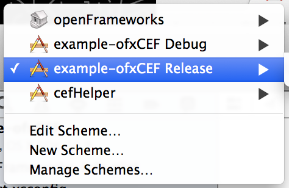
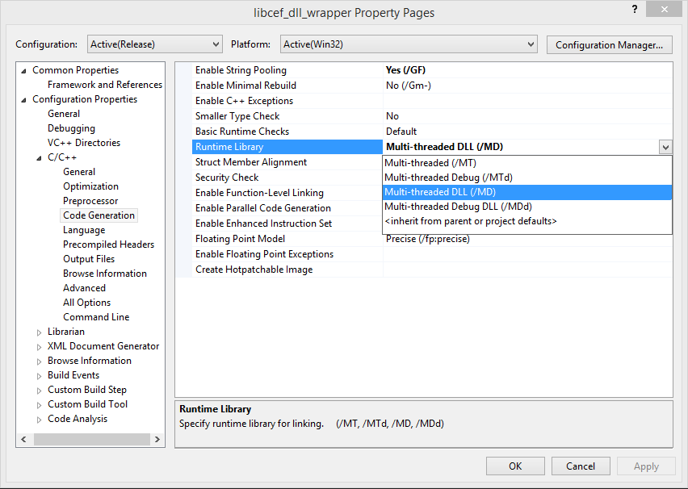

# ofxCEF

an attempt to get CEF working in openframeworks as an alternative to awesomium, berkelium, etc.   [More info on CEF](https://bitbucket.org/chromiumembedded/cef) [wiki](https://bitbucket.org/chromiumembedded/cef/wiki/Home)

## oddities: 

### OSX and Xcode

we have some issues closing the app because of some awkwardness with autorelease pool ([more info](http://www.magpcss.org/ceforum/viewtopic.php?f=6&t=11441&p=24037&hilit=AutoreleasePoolPage#p24037)).  Thus we do some tomfoolery in ofMain to init CEF before OF, and pass things around. 

Also, because of how CEF works, you will need to compile the helper app first

then compile the demo app itself

### Windows and Visual Studio

* Copy the content the Chromium Embedded Framework 3 Build package in this folder in the folder libs/CEF/win32. For details, see the ofxCEF-README.txt included in the folder libs/CEF/win32.
* Add libcef_dll_wrapper.vcxproj and the ZERO_CHECK.vcxproj to your existing Visaul Studio solution.
* Link against libcef.lib.
* Make sure the addon files in src/, libs/CEF/win32/include and libs/CEF/win32 are in your include path.
* Ensure libcef_dll_wrapper is a dependency of your own project (Project Name > Project Dependencies).
* Ensure libcef_dll_wrapper is referenced by your project (Project Name > References > Add New Reference).
* You may have to change the Runtime Library of the libcef_dll_wrapper.vcxproj (see screenshot below).

